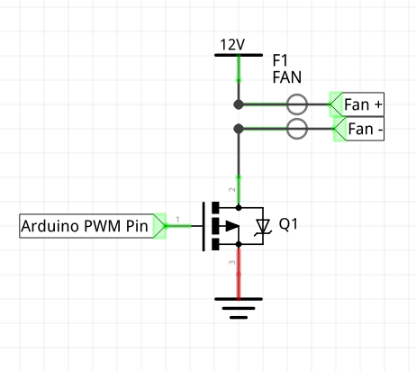

FanDuino è un fan controller basato arduino con un interfaccia per controllare il comportamento delle ventole.
È disponibile solamente per arduino mega2560.

# SENSORI DI TEMPERATURA
Supporta i seguenti sensori di temperatura:
  - DHT11 [**Consigliato**]
  - LM35DZ
  - MPC9700
  > È consigliato utilizzare il sensore DHT11, che è essendo un sensore digitale non soffre di disturbi e permette di avere un lettura più precisa.

# VENOTLE
Supporta ventole a 2 o 3 pin, è consigliato usare un ventola a 3 pin.
Per utilizzare le ventole è necessario usare un mosfet npn, collegando:

  - il + della ventola [filo rosso] a +12V.
  - il gate al pin pwm dell'arduino.
  - il source al GND della ventola [filo nero].
  - il drain a GND.
  - il filo giallo della ventola, al pin dell'interrupt

Utilizzando il filo giallo FanDuino avrà una regolazione più precisa per impostare la ventola della ventola alle basse velocità.
È possibile gestire la velocità delle ventole o in modalità manuale o in modalità automatica [Vedi PROFILAZIONE]

# LED RGB
È possibile collegare uno o più led RGB, in modo da poter controllare un led all'interno del vostro case.

# PROFILAZIONE
È possibile automatizzare la velocità di una o più ventole in base alla temperatura letta da un sensore, con la possibilità di impostare 3 tipi di profili.
  - **SILENZIOSO**, mantiene la velocità della ventola più bassa possibile in modo da essere il più silenzioso possibile.
  - **PERFORMANCE**, la velocità della ventola aumenta molto se aumenta la temperatura.
  - **MANUALE**, è possibile impostare la velocità della ventola in percentuale per ogni intervallo di temperatura a blocchi di 10°.

# COME FUNZIONA
- La comunicazione tra computer e arduino avviene tramite **seriale**, il sistema utilizza un **buffer** in cui memorizza i dati ricevuti dalla seriale e ci accede solamente in un secondo momento.

- Per leggere i dati dai sensori analogici utilizza gli **ADC interni**, mentre per leggere i dati dai sensori digitali [**DHT11**] utilizza un protocollo digitale.

- Per controllare la ventola utilizza un **segnale PWM** in cui il duty cicle è proporzionale alla velocità della ventola.

- Per garantire che anche con un duty cicle basso la ventola gira, il sistema utilizza l' encoder pin (se disponile), quindi attraverso un sistema di interrupt garantisce che la ventola stia girando.

- Per controllare i led, setta un segnale alto o basso a seconda del colore che si vuole accendere.

# COME UTILIZZARLO
  Nella cartella client c'è il software che andrà a girare sul pc linux:
  - Compilare con:
  > make

  - Eseguire con:
  > ./pc

  Nella cartella AVR c'è il software che girerà su arduino:
  - Compilare con:
  > make

  - Flashare con:
  > make load

Sviluppato da Luca Giovannesi (@luca_giovannesi) e Nicolas Benko (@RedAgony)
